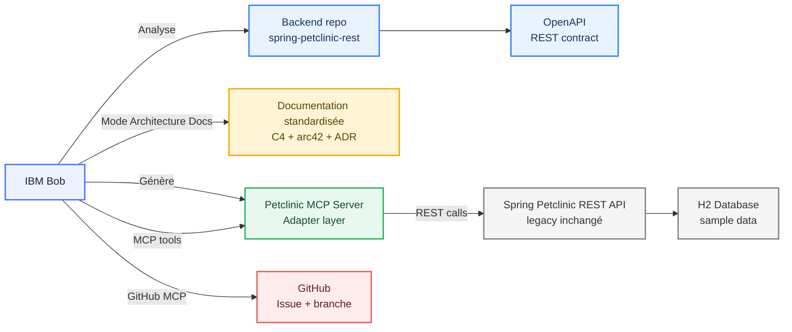

# Architecture Diagram - PetClinic MCP Demo

Ce diagramme illustre l'architecture complète de la démonstration PetClinic avec IBM Bob et le serveur MCP.

## Description des composants

### 🤖 IBM Bob
Assistant IA qui :
- Analyse le repository backend
- Génère de la documentation standardisée
- Crée le serveur MCP
- Utilise les outils MCP pour interagir avec l'API
- Intègre avec GitHub via GitHub MCP pour la gestion des issues et branches

### 📦 Backend Repository (spring-petclinic-rest)
Repository Spring Boot existant contenant :
- Code source Java
- Contrat OpenAPI REST
- Configuration de base de données
- Tests unitaires et d'intégration

### 📄 OpenAPI REST Contract
Spécification OpenAPI 3.0 définissant tous les endpoints REST de l'API PetClinic.

### 📚 Documentation standardisée
Documentation générée par Bob suivant les standards :
- **C4 Model** : Diagrammes de contexte, conteneurs, composants
- **arc42** : Template de documentation d'architecture
- **ADR** : Architecture Decision Records

### 🔌 Petclinic MCP Server (Adapter Layer)
Serveur MCP Node.js généré par Bob qui :
- Expose 16 outils read-only
- Fait le pont entre Bob et l'API REST
- Utilise le protocole MCP (Model Context Protocol)
- Communique via stdio (JSON-RPC)

### 🌐 Spring Petclinic REST API
API REST Spring Boot legacy (inchangée) qui :
- Expose les endpoints CRUD
- Gère la logique métier
- Persiste les données en base

### 💾 H2 Database
Base de données en mémoire contenant :
- 10 propriétaires
- 13 animaux (chats, chiens, oiseaux, etc.)
- 6 vétérinaires
- 4 visites vétérinaires
- Types d'animaux et spécialités

### 🐙 GitHub
Intégration GitHub via GitHub MCP pour :
- Gestion des issues (list_issues, issue_read, issue_write)
- Création de branches (create_branch, list_branches)
- Pull requests (create_pull_request, list_pull_requests)
- Code reviews (pull_request_review_write)

## Flux de données

1. **Analyse** : Bob analyse le repository et le contrat OpenAPI
2. **Documentation** : Bob génère la documentation standardisée
3. **Génération** : Bob crée le serveur MCP adapter
4. **Interaction** : Bob utilise les outils MCP pour interroger l'API
5. **Persistance** : L'API persiste les données dans H2
6. **Collaboration** : Bob utilise GitHub MCP pour la gestion du code

## Technologies utilisées

- **Backend** : Spring Boot 3.x, Java 17
- **API** : REST, OpenAPI 3.0
- **MCP Server** : Node.js, @modelcontextprotocol/sdk
- **Database** : H2 (in-memory)
- **Documentation** : Markdown, Mermaid, C4, arc42
- **Version Control** : Git, GitHub
- **AI Assistant** : IBM Bob

## Avantages de cette architecture

✅ **Non-invasif** : L'API legacy reste inchangée  
✅ **Découplage** : Le serveur MCP isole Bob de l'API  
✅ **Extensible** : Facile d'ajouter de nouveaux outils MCP  
✅ **Standardisé** : Utilise le protocole MCP officiel  
✅ **Documenté** : Documentation générée automatiquement  
✅ **Testable** : Chaque composant peut être testé indépendamment